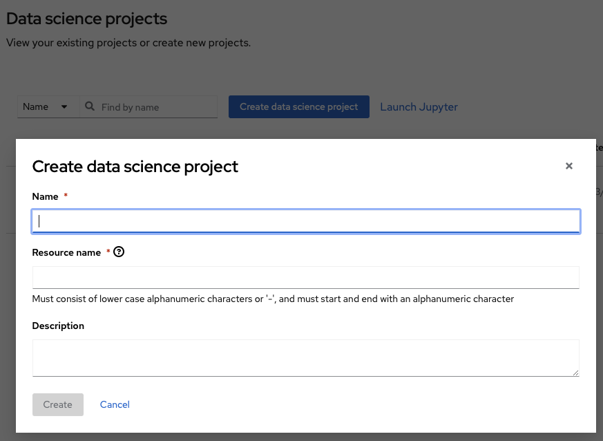

# Geospatial Foundation Models: Fine-tuning of downstream tasks 
This repository contains all the instructions and examples for running GFM fine-tuning on the FM software stack.

**Contact:** Blair Edwards (IBM Research) - bedwards@uk.ibm.com


```
NB: The inital deployment instructions here assume that your training data, GFM model weights etc are uploaded to a volume on the cluster or a shared volume on your local machine or cluster.  The process for this is described below.  In the future, we will expand to support pulling inputs from S3/COS directly into deployed jobs.
```

The examples of the training shown here are image segmentation tasks and primarily use the mmsegmentation library (updated to integrate with GFMs).  

## Examples
The following examples can be used and built upon:
- [HLS Flood mapping](Flood%20Mapping/Flood%20Mapping.md)
- [HLS Burn Scar mapping](Burn%20Scars/Burn%20Scars.md)


## Setup - FM Stack deployment
The Foundation model software stack is Red Hat Open Data Science (RHODS) deployed on OpenShift with CodeFlare.  The instructions below expect the initial interaction through the JupyterLab environment, but subsequently jobs can be launched remotely.

### Prepare the project environment
First, we need setup our project environment on the platform.  This involves creating the project, creating the volumes, secrets etc required to then run experiments.

1. Log in to the RHODS dashboard.
2. Create a project (or select your existing project).

3. Create a volume (PVC) on the cluster.  - eventually through teh cluster storage option.
4. Add any image pull secrets to the project (or pulling images from private registries).
5. Create a new workbench (aka Jupyterlab server).
6. Attach the volume to the workbench.

NB: if you want to use a private github repo, run the following in a terminal:
```bash
git config --global credential.helper store
```
then ru

### Setting up your experiments
Now that we have the project setup, we can start to prepare to run experiments.  The general steps are below, with helper scripts to setup a folder structure and pull data and/or models from S3/COS.

1. Create your folder structure for input data and outputs.
2. Place your training datasets in the shared volume.  You will then reference the path in your training/test configuration file.  This can be seen in practice in the example tasks (linked below).
3. Grab the pre-trained weights from the GFM that you want to use as your starting point and put them in the project folder on the shared volume.

### Running experiments
The exact details of how you setup and submit your fine-tuning tasks will vary from project to project.  The example steps below are from the Flood mapping example (linked above):

1. Prepare your training config file for mmsegmentation.  This file specifies the pipelines, options, points to the data and pre-trained weights, amoungst other things.
2. Place the config file on the shared volume.  In the example, it is in a folder called configs.
3. Log in to the cluster. Click on the link, <link_here> , then run it on the command link or paste it into a notebook cell.
4. Submit the job using TorchX referencing the run script, config and options:
5. Monitor the job using TorchX commands to list the running tasks and then pull the log files.
6. As the training proceeds, the model checkpoints and training metrics will be dumped to the outputs folder on the shared volume.  The notebook has examples of how to parse these and plot the metrics.
7. Once the training is finished (or at any point once you have checkpoint file), you can submit a test task using similar commands (see notebooks for mmsegmentation examples).

## Setup - Local deployment
Instructions to follow......


