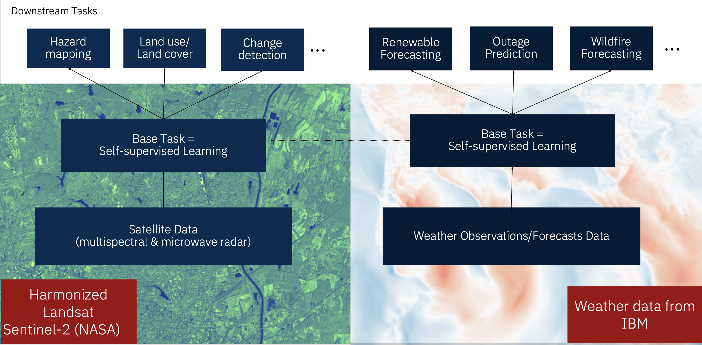

# Application: Geospatial Foundation Model

The examples of the training shown here are image segmentation tasks and primarily use the mmsegmentation library (updated to integrate with GFMs).  

## Examples
The following examples can be used and built upon:
- [HLS Flood mapping](Flood%20Mapping/Flood%20Mapping.md)
- [HLS Burn Scar mapping](Burn%20Scars/Burn%20Scars.md)

## Summer school workshop
1. Log in to SMCE Data Science dashboard - https://rhods-dashboard-redhat-ods-applications.apps.codeflare.xx6d.p1.openshiftapps.com
2. Select `Data Science projects` on the left, then select the project that has been set up for you.
3. Open your workbench.
4. First, we need to clone the code repository from github.  To do this from the launcher, open a terminal and run:  `git clone https://github.com/NASA-IMPACT/summer-school-2023.git`
5. Navigate to `Chapter 3` and select either the `Burn Scars` or `Flood Mapping`.  The folder will include a notebook to train a downstream task from a Geospatial Foundation Model and a template experiment configuration.
6. Open the notebook

## Contacts
| Name | Email |
| ---- | ----- |
| Blair Edwards (IBM Research) | bedwards@uk.ibm.com |
| Paolo Fraccaro (IBM Research) | paolo.fraccaro@ibm.com |
| Johannes Jakubik (IBM Research) | johannes.jakubik@ibm.com |
| Linsong Chu (IBM Research) | lchu@us.ibm.com |
| Muthukumaran Ramasubramanian | muthukumaranr17@gmail.com |
